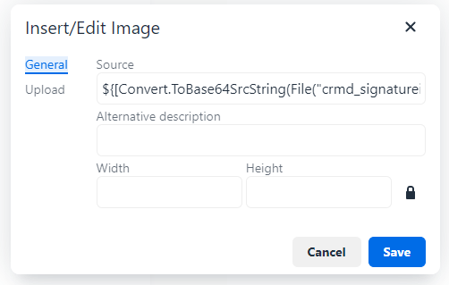

## Basics

In CRMDocs365, anything that requires calculations or mail merging with data from Dataverse needs to be placed between formula delimiters `${` and `}`. **This includes mail merge tokens and if statements**.

## Formulas

To insert a formula simply start a formula placeholder as explained above and insert your logic. Below is the list of supported operators and some examples.

- All maths operators + - \* \*\* / %
- Comparison > < >= <= == !=
- Mail merge tokens `${[prefix_column]}`
- Conditionals `${if 1 + 2 == 3 (true) (false)}`

## Tokens

A token is a placeholder to tell the system where the data should go. This token will be replaced at the time of creating a document by the mail merge engine.

To insert a mail merge token you need to surround the dataverse column's **logical name** (this is usually in the format of _prefix_column_) with the token delimters _[_ and _]_. Remember to wrap it inside formula delimiters.

### Formatted values

Lookups, Dates and OptionSet also have an extra **formatted** value that can be mail merged. This value will give different results based on the field type.

| Type      | Value                                                                                                                                    | Formatted                                                                                                                                                                                                                             |
| --------- | ---------------------------------------------------------------------------------------------------------------------------------------- | ------------------------------------------------------------------------------------------------------------------------------------------------------------------------------------------------------------------------------------- |
| Date      | DateTime **object** in UTC format. Useful when needing to use a custom format. See [Date and Time](#date-and-time) for more information. | DateTime **string** formatted using personal preferneces. This is important to know because when mail merging for a signature the process is handled by an _Application User_ which needs to be configured with the correct timezone. |
| Lookup    | Unique identifier (Guid)                                                                                                                 | The value of the primary field (in most cases is _name_).                                                                                                                                                                             |
| OptionSet | Numerical value of the option. This is useful when making comparisons or using the column inside a formula.                              | The label of the option.                                                                                                                                                                                                              |

To access the formatted value simply add the suffix **\_formatted** to the token: `${[primarycontactid_formatted]}`

## Built-in functions

Below is a collection of built-in functions provided by the framework. These functions perform complex tasks otherwise not possbile with simple mail merging techniques. Most of the functions are grouped into collections and each individual function can be accessed using the dot notation (**Collection.Function**). It is important to use the function during the mail merge and not the collection alone, to avoid unwanted errors. For example **DateTime** will not give you the current time; **DateTime.Now** will.

### Date and Time

The system provides with a **DateTime** collection of date related functions.

The system will only provide the date and time in UTC format. This is important to know when it comes to signature and timestamps.

The simplest function within DateTime is **Now**. This function returns the current date and time object which can then be formatted using several different modifiers.

| Snippet                                    | Description                                                        |
| ------------------------------------------ | ------------------------------------------------------------------ |
| `${[DateTime.Now.ToString()]}`             | Simple date and time with no formatting                            |
| `${[DateTime.Now.ToShortDateString()]}`    | Date only                                                          |
| `${[DateTime.Now.ToString("dd-MM-yyyy")]}` | Date and time formatted using the specific pattern in parentheses. |

DateTime formatting reference

The table below explains in details how to use the formatting options for a date object. Some of the formatting are quite advanced and are only used in special cases.

| Token     | Description                                                                                                                                                      |
| --------- | ---------------------------------------------------------------------------------------------------------------------------------------------------------------- |
| d         | Day of the month as a number from 1 through 31.                                                                                                                  |
| dd        | Day of the month as a number from 01 through 31.                                                                                                                 |
| ddd       | Abbreviated name of the day (Mon, Tue, etc.).                                                                                                                    |
| dddd      | Full name of the day (Monday, Tuesday, etc.).                                                                                                                    |
| h         | 12-hour clock hour (7).                                                                                                                                          |
| hh        | 12-hour clock hour with leading zero (07).                                                                                                                       |
| H         | 24-hour clock hour (19).                                                                                                                                         |
| HH        | 24-hour clock hour with leading zero.                                                                                                                            |
| m         | Minutes.                                                                                                                                                         |
| mm        | Minutes with leading zero.                                                                                                                                       |
| M         | Month number (5).                                                                                                                                                |
| MM        | Month number with leading zero (05).                                                                                                                             |
| MMM       | Abbreviated month name (Nov, Dec, etc.).                                                                                                                         |
| MMMM      | Full month name (November, December, etc.).                                                                                                                      |
| s         | Seconds.                                                                                                                                                         |
| ss        | Seconds with leading zero.                                                                                                                                       |
| t         | Abbreviated AM / PM (A or P).                                                                                                                                    |
| tt        | AM / PM.                                                                                                                                                         |
| y         | Up to two digits year (24).                                                                                                                                      |
| yy        | Up to three digits year with leding zero (024).                                                                                                                  |
| yyy       | Full year (2024).                                                                                                                                                |
| yyyy      | Full year with leading zero (2024).                                                                                                                              |
| K         | Timezone information (+05:00).                                                                                                                                   |
| z         | Signed offset of the local operating system time zone from UTC, measured in hours (+4).                                                                          |
| zz        | Same as **z** but with leading 0 (+04).                                                                                                                          |
| zzz       | Same as **zz** but measured in hours and minutes (+04:00).                                                                                                       |
| f-fffffff | Each **f** represents a significant digit in the seconds fraction. a single f represents tenths of a second while seven fs represent ten-millionths of a second. |

Below are some example snippets that can be quickly referenced and used in your templates.
| Snippet | Result |
|---------|--------|
| `${[DateTime.Now.ToString("MM/dd/yyyy")]}` | 05/29/2015 |
| `${[DateTime.Now.ToString("dddd, dd MMMM yyyy")]}` | Friday, 29 May 2015 |
| `${[DateTime.Now.ToString("dddd, dd MMMM yyyy")]}` | Friday, 29 May 2015 05:50 |
| `${[DateTime.Now.ToString("dddd, dd MMMM yyyy")]}` | Friday, 29 May 2015 05:50 AM |
| `${[DateTime.Now.ToString("dddd, dd MMMM yyyy")]}` | Friday, 29 May 2015 5:50 |
| `${[DateTime.Now.ToString("dddd, dd MMMM yyyy")]}` | Friday, 29 May 2015 5:50 AM |
| `${[DateTime.Now.ToString("dddd, dd MMMM yyyy HH:mm:ss")]}` | Friday, 29 May 2015 05:50:06 |
| `${[DateTime.Now.ToString("MM/dd/yyyy HH:mm")]}` | 05/29/2015 05:50 |
| `${[DateTime.Now.ToString("MM/dd/yyyy hh:mm tt")]}` | 05/29/2015 05:50 AM |
| `${[DateTime.Now.ToString("MM/dd/yyyy H:mm")]}` | 05/29/2015 5:50 |
| `${[DateTime.Now.ToString("MM/dd/yyyy h:mm tt")]}` | 05/29/2015 5:50 AM |
| `${[DateTime.Now.ToString("MM/dd/yyyy HH:mm:ss")]}` | 05/29/2015 05:50:06 |
| `${[DateTime.Now.ToString("MMMM dd")]}` | May 29 |
| `${[DateTime.Now.ToString("yyyy-MM-ddTHH:mm:ss.fffffffK")]}` | 2015-05-16T05:50:06.7199222-04:00 |
| `${[DateTime.Now.ToString("ddd, dd MMM yyy HH:mm:ss GMT")]}` | Fri, 16 May 2015 05:50:06 GMT |
| `${[DateTime.Now.ToString("yyyy-MM-ddTHH:mm:ss")]}` | 2015-05-16T05:50:06 |
| `${[DateTime.Now.ToString("HH:mm")]}` | 05:50 |
| `${[DateTime.Now.ToString("hh:mm tt")]}` | 05:50 AM |
| `${[DateTime.Now.ToString("H:mm")]}` | 5:50 |
| `${[DateTime.Now.ToString("h:mm tt")]}` | 5:50 AM |
| `${[DateTime.Now.ToString("HH:mm:ss")]}` | 05:50:06 |
| `${[DateTime.Now.ToString("yyyy MMMM")]}` | 2015 May |

### Files and Images

This content is experimental and can cause unwanted behaviour.

The system allows to use the new file and images columns in Dynamics to fetch complext data or images and mail merge them into the final document. To target a File column simply use the **File** function and pass the name of the column surrounded by double quotes in the parentheses. The system will automatically fetch the file content and insert it at the token position. `${[File("prefix_filecolumn")]}`

However this by itself is not very useful as it returns the file in binary format. By using the **ToPlainText** function, in the **Convert** collection, we can convert the binary data into its string representation, which can then be inserted into the document.

File column: `${[Convert.ToPlainText(File("prefix_filecolumn"))]}`. _Place this snipped of code anywhere in the template_.

To fetch an image it is a very similar process but the data needs to be converted to a special url that the system can display. We can use the **Convert** collection again which includes the **ToBase64SrcString** function. This function expects binary data (which comes from the File function) and converts it into a url that an image component can correctly display.

Image column: `${[Convert.ToBase64SrcString(File("prefix_imagecolumn"))]}`. _Place this snipped into the source of the image component in the editor_.

Using this snippet alone anywhere else will **NOT** display an image but a very long string instead.

## Conditionals

Conditionals allow to toggle specific parts of the templates or text depending on one or more conditions. The condition is evaluated and must return a **True** or **False** result (think of it as a yes or no). After the condition is evaluated then the corresponding branch will be evaluated further, while the other will be ignored.

To create a conditional start with the word **if** followed by a **condition** or **formula** and followed by two sets of parentheses for the true outcome and false outcome respectively. Mail merge tokens are allowed to be used in any part of the if statement and the value will be used when evaluating the condition. See the example below:

`${if [prefix_column] != null (column contains data) (column does not contain data)}`
